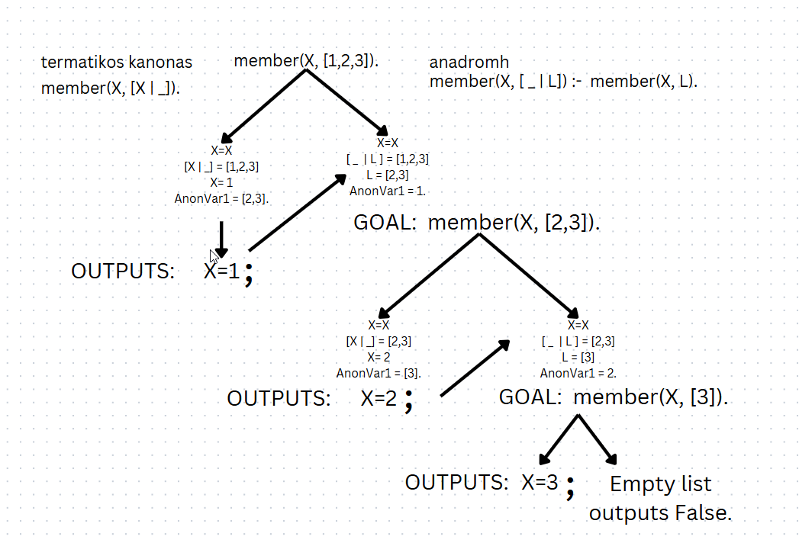

# 📜 Prolog Notes

## 🔹 Introduction

Prolog is a logic programming language used for AI, databases, and symbolic computation.  

> Prolog is a dynamically typed language.

> Prolog supports the logic based programming paradigm

> In prolog, you define your program as a set of relations --> These relations form a database --> You can then use this database to perform queries.

---

# 📌 1. Facts (Basic Assertions)

Facts define relationships between objects.

```bash
parent(john, mary).
likes(mary, pizza).
```

✅ Usage:

```
?- parent(john, mary).
true.
```

# 📌 2. Rules (Logical implications)

Rules define how facts relate.

```
grandparent(X, Y) :-
	parent(X, Z),
	parent(Z, Y).
```

# 📌 3. Variables (Uppercase letters)

Variables are placeholders for uknown values.

```
sibling(X, Y) :-
	parent(Z, X),
	parent(Z, Y),
	X \= Y.
```

# 📌 4. Recursion

Defining ancestor(X, Y) if one of the following persists:

1. X is parent of Y 
2. X is parent of Z and Z is ancestor of Y

```
ancestor(X, Y) :-
	parent(X, Y).

ancestor(X, Y) :-
	parent(X, Z),
	ancestor(Z, Y).
```

# 📌 5. Structs

We can define a data structure as a groupping of data with a unified name.

e.x. date(18,12,2011) represents 18-12-2011

A data structure is the same thing as a constant value.

```
born(tom, date(12,12,1998)).
born(john, date(13,1, 1990)).
```

# 📌 6. Lists

Basic data structure in prolog.

A list can have an arbitrary number of elements in contrast to the predicates

Example

```
children(tom, [john, jim]).
```

In prolog, lists are implemented under the hood using bound predicates ./2 and [].

Internal representation of a list:

```
children(tom, .(john, .(jim, []))).
```

We can also express lists in the following  form:

> [H | T].

for example:

```
?- children(F, [X | Y]).
F = tom,
X = john,
Y = [jim].
```

## Predefined predicates relevant to lists

### 1. member

> member(X, L): if X E L.
>
> Implementation - Implemented using recursion:
>
> ```
> 	member(X, [X | _]).  				% TERMATIKOS KANONAS
>
> 	member(X, [ _ | L]) :-  		% ANADROMH
>
> 		member(X, L).
> ```

In the following picture, an example is represented using the execution tree.

<p align="center">
  
</p>

### 2. append/2

> append(L1, L2, L): if L1 + L2 = L 
>
> Implementation - Implemented using recursion:
>
> ```
> 	append([ ], L, L).			                  % TERMATIKOS KANONAS
>
> 	append( [X | L1], L2, [X | L3]) :-    		% ANADROMH
>
> 		append(L1,L2,L3).
> ```
>
>
In the following picture, an example is represented using the execution tree.

<p align="center">
  
</p>
